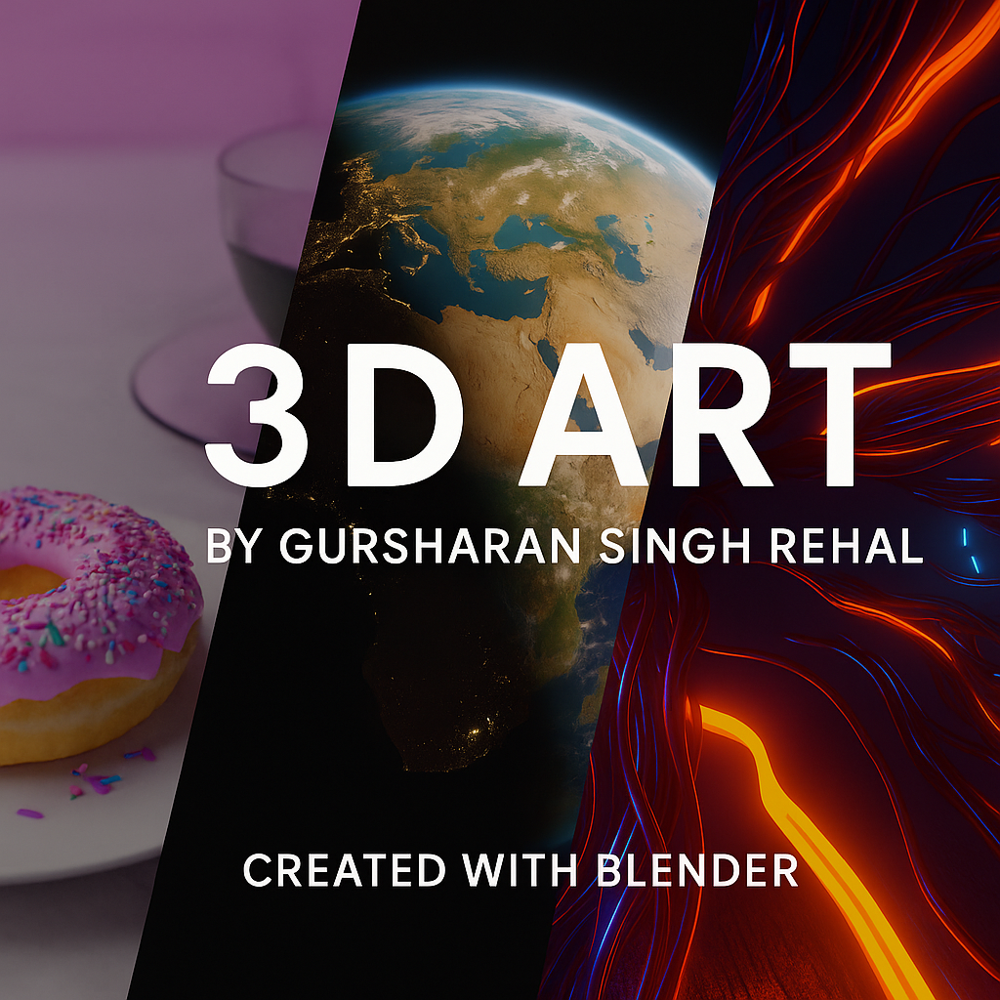

<h1 align="center">🎨 Blender 3D Art Portfolio</h1>

  

<i>A personal gallery of high-quality 3D visual art created using Blender.</i>

---

## 📌 Overview

This repository is a showcase of my 3D modeling and rendering journey using Blender. Each piece is carefully crafted to explore different aspects of digital design—from realistic lighting and textures to stylized animations and material shaders.

The portfolio includes:

- 🍩 Realistic food modeling (e.g., donut & coffee scene)
- 🌍 Earth model with accurate satellite lighting
- ⚡ Abstract sci-fi compositions
- 🎮 Logo renderings with stylized lighting

---

## 🧰 Tools Used

- **Blender 3.x** (Cycles & Eevee Render Engines)
- HDRi Lighting & PBR Shading
- Compositing Nodes
- Color Grading with Filmic Transform

---

## 💡 Future Additions

- Stylized character modeling
- Environment design
- Real-time animation scenes

---

## 📬 Contact

Feel free to connect or provide feedback:

**Gursharan Singh Rehal**  
📧 gursharanXsingh@gmail.com 
🌐 [Portfolio Website](https://your-portfolio-link.com) *

---
